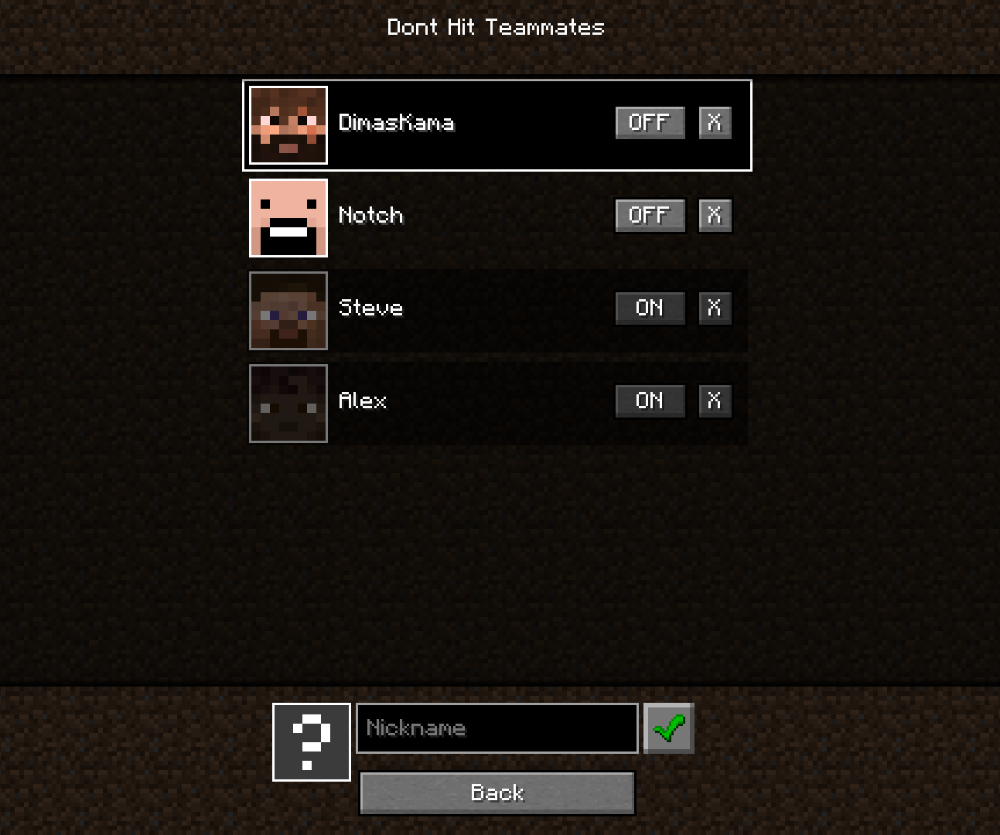

# Dont Hit Teammates

Client-side Fabric mod. Prevents hand attacking players, that you added to list.

## Config

Mod enables & disables with keybinding (default KP_2).

Mod has also config settings `save_enabled_state` and `save_teammates_list`, that configures saving other values between game restarts. Change them with `/donthitteammates` command

You can configure teammates list in UI, by typing in their nicknames. 

Open this screen with keybinding (default KP_3) or from ModMenu.

The Config is stored in `config/donthitteammates.json`

